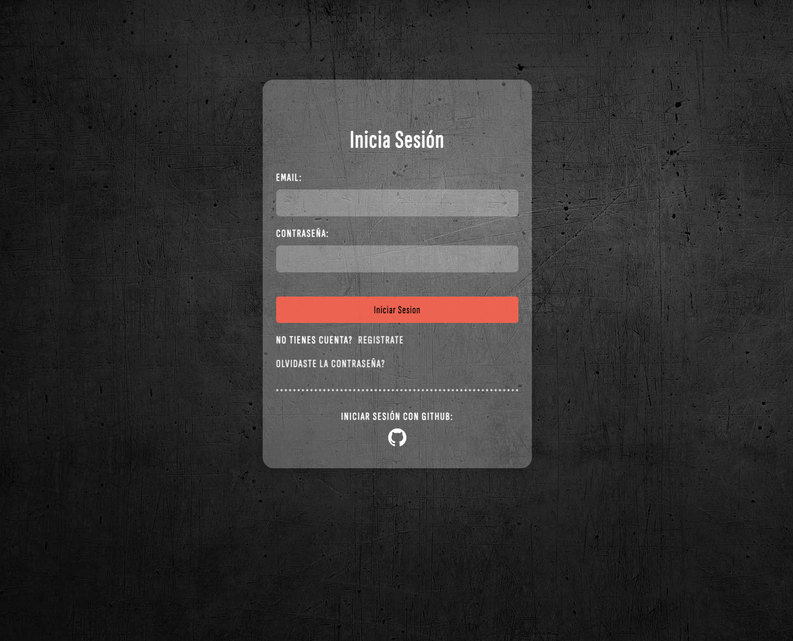
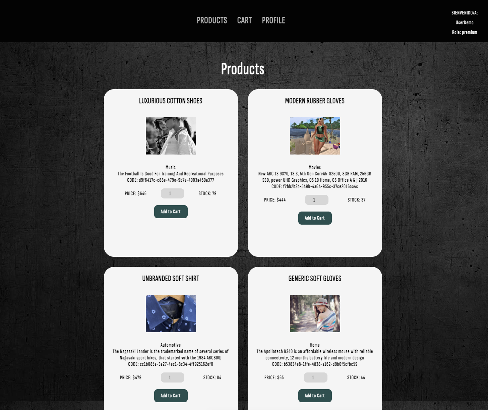

# Ecommerce
<a name="readme-top"></a>

<!-- TABLE OF CONTENTS -->
<details>
  <summary>Tabla de contenido</summary>
  <ol>
    <li>
      <a href="#sobre-el-proyecto">Sobre el Proyecto</a>
      <ul>
        <li><a href="#construido-con">Construido con</a></li>
      </ul>
    </li>
    <li>
      <a href="#comenzando">Comenzando</a>
      <ul>
        <li><a href="#pre-requisitos">Pre-requisitos</a></li>
        <li><a href="#instalación">Instalación</a></li>
      </ul>
    </li>
    <li><a href="#funcionalidades-del-proyecto">Funcionalidades del proyecto</a></li>
    <li><a href="#licencia">Licencia</a></li>
    <li><a href="#contacto">Contacto</a></li>
  </ol>
</details>

## Sobre el Proyecto
Este es un proyecto creado para la cursada de PROGRAMACION BACKEND de CODERHOUSE. 
Se trata de un ecommerce ( Tienda Virtual ) que sirve para la venta de productos de forma online de indumentaria para cualquier género.





### Construido con

Lista de Plataformas / Frameworks / Libraries que vas a necesitar

* [![Node][Node.js]][Node-url]
* [![Mongo][Mongo.com]][Mongo-url]
* [![Laravel][Laravel.com]][Laravel-url]
* [![Github][Github.com]][Github-url]
* [![Handlebars][Handlebars.com]][Handlebars-url]
* [![JWToken][JWToken.com]][JWToken-url]
* [![VisualStudioCode][Visualstudio.com]][VSC-url]

<p align="right">(<a href="#readme-top"> Ir arriba </a>)</p>


## Objetivos Especificos

* Conseguir una experiencia de compra completa
* Cerrar detalles administrativos con los roles.

Mira Deployment a continuación para conocer el proyecto.

[](https://react-js-pf-sdrigotti-rodrigo.vercel.app/)


#### Pre-requisitos 
Que cosas necesitas para el proyecto y como instalarlas:

Visual Studio Code + Mongoose + Node js + Postman (Opcional)

#### Instalación 

Instrucciones para setear tu app.

1. Clonar el repositorio
   ```sh
   git clone https://github.com/rodrigosdrigotti/PB-SdrigottiRodrigo-ProductManager.git
   ```
2. Install NPM packages para inicilizar y verlo en tu explorador en [http://localhost:8080/login](http://localhost:8080/login)
   ```sh
   npm install
   ```
3. Para la base de datos.
   ```sh
   npm install mongoose
   ```
4. Para modo desarrollo.
   ```sh
   npm run start:dev
   ```
5. Para modo producción.
   ```sh
   npm run start:prod
   ```

<p align="right">(<a href="#readme-top"> Ir arriba </a>)</p>

### Funcionalidades del proyecto

- `USERS`: Registro y Login con recupero de Contraseña
    - Endpoints: 
        - POST login with JWT Token and Passport
        - POST Register with JWT Token and Passport
        - GET login with Github Account
        - GET logout user
        - GET list of users 
        - GET user by ID
        - DELETE inactive users (48hs)
        - DELETE user by ID
        - PUT uptdate role user
        - POST recover user inactive

- `PRODUCTS`: CRUD de Productos
    - Endpoints:
        - GET list of products
        - GET product by ID
        - POST create a product
        - PUT update a product
        - DELETE product by ID
- `CARTS`: CRUD de Carts
    - Endpoints:
        - POST create an empty cart or update quantity
        - POST add a product to a cart by ID
        - GET all carts by User ID
        - GET cart by ID
        - GET purchase a cart
        - DELETE empty a cart
        - DELETE product in the cart by ID
- `OTHER FEATURES`: Diferentes vistas 
    - Endpoints: 
        - GET mocking list of Products
        - GET logger Test
        - GET user logged profile
        - GET DTO current user
        - GET add new Products
        - GET reset password
- `CHAT`: Sala de chat with sockets
    - Endpoints:
        - GET Chat Screen
- `MAILING`
- `ERROR HANDLING`

## Licencia

Distribuido bajo la licencia [MIT](https://choosealicense.com/licenses/mit/). Mirá `LICENSE.txt` para más información.

## Contacto

Rodrigo Sdrigotti - [@rodrigosdrigotti](https://www.github.com/rodrigosdrigotti)

Project Link: [https://github.com/rodrigosdrigotti/PB-SdrigottiRodrigo-ProductManager.git](https://github.com/rodrigosdrigotti/PB-SdrigottiRodrigo-ProductManager.git)

<p align="right">(<a href="#readme-top"> Ir arriba </a>)</p>

[Node.js]: https://img.shields.io/badge/node.js-35495E?style=for-the-badge&logo=node.js&logoColor=4FC08D
[Node-url]: https://nodejs.org/es
[Mongo.com]: https://img.shields.io/badge/MongoDB-4EA94B?style=for-the-badge&logo=mongodb&logoColor=white
[Mongo-url]: https://www.mongodb.com/
[Laravel.com]: https://img.shields.io/badge/Javascript-FF2D20?style=for-the-badge&logo=javascript&logoColor=white
[Laravel-url]: https://laravel.com
[Github.com]: https://img.shields.io/badge/GitHub-100000?style=for-the-badge&logo=github&logoColor=white
[Github-url]: https://github.com/
[Handlebars.com]: https://img.shields.io/badge/Handlebars%20js-f0772b?style=for-the-badge&logo=handlebarsdotjs&logoColor=black
[Handlebars-url]: https://handlebarsjs.com/
[JWToken.com]: https://img.shields.io/badge/JWT-000000?style=for-the-badge&logo=JSON%20web%20tokens&logoColor=white
[JWToken-url]: https://jwt.io/
[Visualstudio.com]: https://img.shields.io/badge/VSC-0769AD?style=for-the-badge&logo=visualstudiocode&logoColor=white
[VSC-url]: https://code.visualstudio.com